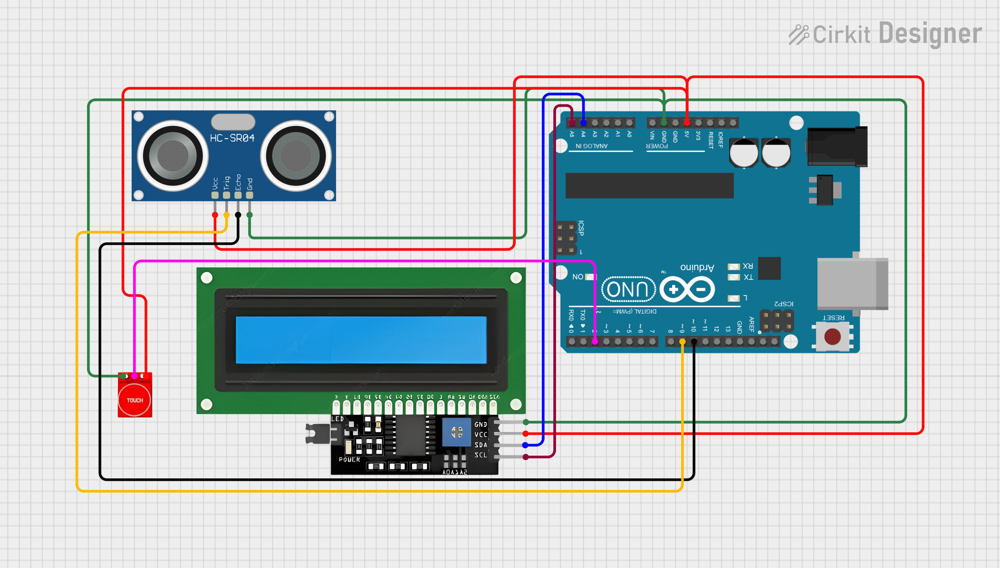

# Arduino-Based Distance Measurement System

This project is a simple distance measurement system developed as part of the **Measurement and Instrumentation** course. It uses an Arduino Uno, an HC-SR04 ultrasonic sensor, a TP223 capacitive touch sensor, and an I2C 16x2 LCD display to measure and display distances in real time.

---

## Features
- Capacitive touch sensor toggles ON/OFF state
- Ultrasonic sensor measures distance in centimeters
- Real-time distance shown on I2C LCD display
- Debugging output via Serial Monitor

---

## Hardware Required
- Arduino Uno
- HC-SR04 Ultrasonic Distance Sensor
- TP223 Capacitive Touch Sensor Module
- I2C 16x2 LCD Display
- Jumper Wires
- Breadboard

---

## Circuit Diagram



> 📌 **Note**: Ensure the following pin connections:
> - **HC-SR04**: `Trig → D9`, `Echo → D10`
> - **TP223 Touch Sensor**: `OUT → D2`
> - **I2C LCD**: Uses `A4 (SDA)` and `A5 (SCL)` on Arduino Uno

---

## Working Principle

The TP223 capacitive touch sensor acts as an ON/OFF switch. When touched, it toggles the Arduino into an active measuring state. While active, the Arduino sends a pulse through the HC-SR04, which emits an ultrasonic wave. The time it takes for the echo to return is used to calculate distance using the formula:

```latex
\[
\text{Distance (cm)} = \frac{\text{Time (microseconds)} \times 0.0343}{2}
\]
